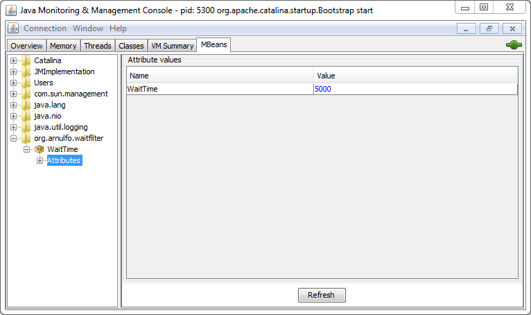

# WaitFilter

A simple wait filter for java web application.

## What for

Add a Thread.sleep(x ms) on your web application to test.

Usefull for testing purpose like how your javascript app behave when calling a slow REST api.

## How to use

Add the release jar to your WEB-INF/lib directory.

Add filter configuration in your web.xml :

```java
    <filter>
        <filter-name>WaitFilter</filter-name>
        <filter-class>net.arnulfo.waitfilter.WaitFilter</filter-class>
        <init-param>
            <!-- Time to sleep in millisecond -->
            <param-name>WaitTime</param-name>
            <param-value>5000</param-value>
        </init-param>
    </filter>
    <filter-mapping>
        <filter-name>WaitFilter</filter-name>
        <url-pattern>/*</url-pattern>
    </filter-mapping>
```
## Bonus: Change waitTime in live with JMX

The wait time can be changed while your web app is running with JMX.
Use a JMX Browser like VisualVM (need MBeans plugin), JConsole or JMC.

